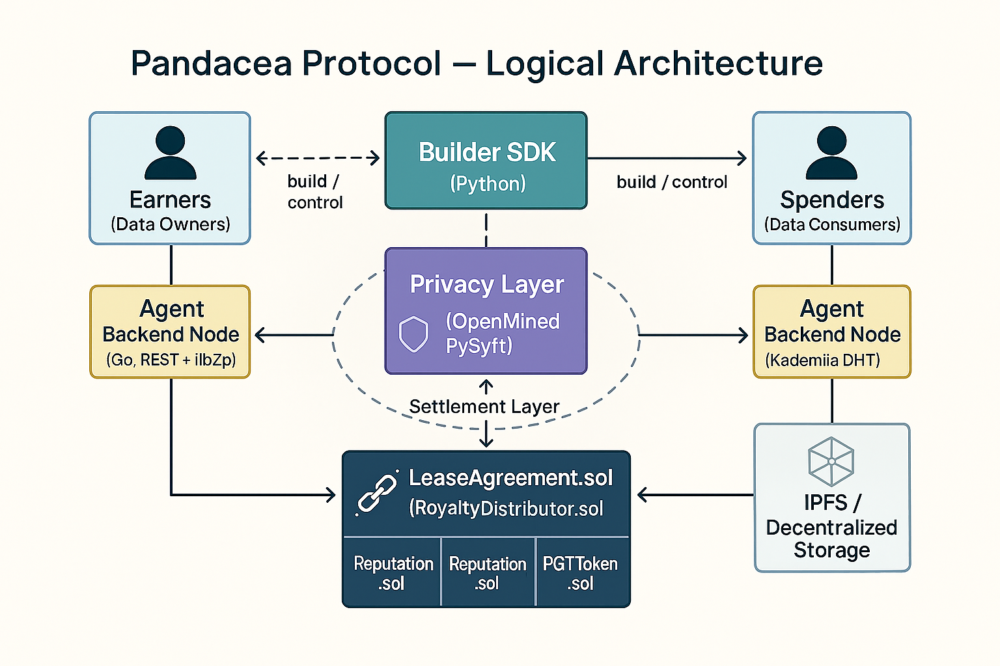

# Pandacea Protocol

[](https://github.com/pandacea/pandacea-protocol/actions/workflows/ci.yml)
[](https://github.com/pandacea/pandacea-protocol/actions/workflows/sdk-ci.yml)
[](https://github.com/pandacea/pandacea-protocol/actions/workflows/agent-ci.yml)
[](https://opensource.org/licenses/MIT)
[](docs/)
[](docs/Pandacea%20Protocol%20Technical%20Whitepaper%20v4.1.pdf)

---

## Mission Statement

The Pandacea Protocol is a decentralized infrastructure layer designed to facilitate a fair, secure, and transparent market for real-world, user-generated data. We address the systemic failures of the current data paradigm by establishing a new framework for "Informational Labor" built on verifiable consent and distributed value. Our protocol creates a human-centered data economy where individuals own and monetize their data while maintaining privacy and control through privacy-preserving computation, fair and transparent marketplace mechanisms, and decentralized governance.

## Core Features

### 🔗 **Decentralized Data Exchange**
- **P2P Agent Architecture**: Built on Go and libp2p for secure, decentralized peer-to-peer networking
- **KAD-DHT Discovery**: Efficient data product discovery through distributed hash tables
- **Direct Negotiation**: Agents communicate directly without centralized intermediaries

### 🔒 **Privacy-Preserving Computation**
- **OpenMined PySyft Integration**: Asynchronous, sandboxed execution of federated learning jobs
- **Trust-by-Proof Model**: Cryptographic guarantees for privacy without sacrificing utility
- **Multi-Tier Privacy**: Federated Learning and Secure Multi-Party Computation options

### ⚖️ **On-Chain Trust & Reputation**
- **Reputation.sol Contract**: Just-in-time decay and tiered reward system
- **Verifiable Consent**: W3C standard Decentralized Identifiers (DIDs) and Verifiable Credentials (VCs)
- **Legal Safe Harbor**: Immutable, auditable trail of consent for regulatory compliance

### 💰 **Economic Security**
- **Differentiated Dispute Stakes**: PGT stake scales with lease value to prevent spam
- **Dynamic Minimum Pricing (DMP)**: Ensures fair pricing through algorithmic validation
- **Perpetual Royalty System**: Original contributors receive ongoing compensation for derivative works

### 🛡️ **Automated Security**
- **CI/CD Pipeline**: Integration with gosec and Bandit for proactive security scanning
- **Structured Logging**: Privacy-preserving event logging with no PII exposure
- **Input Validation**: Strict schema validation for all API requests
- **Abuse Controls**: Rate limiting, quotas, backpressure, and authentication challenges

## System Architecture



### **User Layer**
- **MyData Agent (Earner)**: User-controlled application managing data sources and policies
- **Buyer-Side Agent (Spender)**: Developer-focused application for data discovery and leasing

### **Protocol Layer**
- **P2P Network**: libp2p with KAD-DHT for decentralized communication
- **Storage Layer (IPFS)**: Distributed file system for content addressing
- **Privacy Layer (PySyft)**: Framework for privacy-preserving computation

### **Settlement Layer (Polygon PoS)**
- **LeaseAgreement.sol**: Core smart contract for data lease management
- **Reputation.sol**: Trust and reputation scoring system
- **PGT.sol**: Protocol's native token for economic incentives

## Abuse Controls

The Pandacea Protocol implements comprehensive abuse prevention mechanisms to ensure fair and secure operation:

### **Rate Limiting**
- **IP-based**: 5 requests per second per IP address
- **Identity-based**: 2 requests per second per authenticated identity
- **Burst allowance**: 10 requests for handling legitimate traffic spikes

### **Quotas & Concurrency**
- **Concurrent jobs**: Maximum 2 concurrent training jobs per identity
- **Request size limits**: 10MB maximum request body size
- **Header limits**: 8KB maximum header size

### **Backpressure Management**
- **CPU monitoring**: Triggers at 85% CPU usage
- **Memory monitoring**: Triggers at 2GB memory usage
- **Automatic throttling**: Reduces accepted RPS by 50% under high load

### **Authentication & Security**
- **Challenge-response**: Signed nonce challenges for sensitive routes
- **Greylisting**: 10-minute greylist for IPs exceeding limits
- **Temporary bans**: 30-minute bans for repeated violations

### **Monitoring & Logging**
- **Structured events**: All security decisions logged with timestamps
- **Real-time alerts**: Immediate notification of abuse attempts
- **Audit trail**: Complete history for compliance and debugging

For detailed configuration and testing, see [Security Documentation](docs/security/agent_abuse_controls.md) and [Load Testing Guide](docs/windows_security_loadtest.md).

## Quick Start (Windows)

### Prerequisites

Install the following tools on your Windows machine:

- **Go** (1.24.2+) - [Download](https://golang.org/dl/)
- **Python** (3.11+) - [Download](https://www.python.org/downloads/)
- **Poetry** - [Installation Guide](https://python-poetry.org/docs/#installation)
- **Docker** - [Download](https://www.docker.com/products/docker-desktop/)
- **Syft** - [Installation Guide](https://github.com/anchore/syft#installation)

### Reproducible Builds

The Pandacea Protocol supports reproducible builds for security and compliance:

```bash
# Build all reproducible artifacts (Go, Python, containers)
make repro-build

# Verify reproducibility by building twice and comparing
make repro-verify

# Generate Software Bill of Materials (SBOM)
make sbom
```

For detailed information, see [Reproducible Builds Documentation](docs/reproducible-builds.md).
- **Poetry** - [Installation Guide](https://python-poetry.org/docs/#installation)
- **Node.js** (18+) - [Download](https://nodejs.org/)
- **Docker Desktop** - [Download](https://www.docker.com/products/docker-desktop/)
- **Foundry** - [Installation Guide](https://book.getfoundry.sh/getting-started/installation)
- **IPFS Desktop** - [Download](https://ipfs.io/install/)

### Installation

1. **Clone the Repository**
   ```powershell
   git clone https://github.com/pandacea/pandacea-protocol.git
   cd pandacea-protocol
   ```

2. **Install Agent Backend Dependencies**
   ```powershell
   cd agent-backend
   go mod tidy
   cd ..
   ```

3. **Install Builder SDK Dependencies**
   ```powershell
   cd builder-sdk
   poetry install
   cd ..
   ```

### Running the Environment

1. **Start IPFS Desktop**
   - Launch IPFS Desktop application
   - Ensure it's running on the default port (5001)

2. **Build PySyft Docker Container**
   ```powershell
   cd agent-backend
   .\build_pysyft_image.ps1
   cd ..
   ```

3. **Start Local Blockchain Node**
   ```powershell
   anvil --host 0.0.0.0 --port 8545
   ```

4. **Deploy Smart Contracts**
   ```powershell
   cd contracts
   forge build
   forge script scripts/deploy.sol --rpc-url http://localhost:8545 --broadcast
   cd ..
   ```

5. **Start Go Agent Backend**
   ```powershell
   cd agent-backend
   go run cmd/agent/main.go
   ```

6. **Test the SDK**
   ```powershell
   cd builder-sdk
   python examples/basic_usage.py
   ```

## Run the Demo

### Quick Demo (Mock Mode)
```powershell
# Run the complete end-to-end demo with mock differential privacy
make demo
```

### Windows Users
For detailed Windows setup instructions, see the [Windows Quickstart Guide](docs/windows_quickstart.md).

### Real PySyft Demo (Docker Required)
```powershell
# Build and start PySyft worker container
make pysyft-up

# Set environment variable for Docker execution
setx USE_DOCKER 1

# Close and reopen PowerShell, then run:
make demo-real-docker
```

## Running the Tests

### Unit Tests

**Go Agent Backend:**
```powershell
cd agent-backend
go test ./...
```

**Python SDK:**
```powershell
cd builder-sdk
poetry run pytest tests/
```

### Integration Tests

**Full Integration Test Suite:**
```powershell
cd integration
python test_dispute_system.py
python test_federated_learning.py
python test_onchain_interaction.py
```

**Differentiated Dispute Stakes Tests:**
```powershell
.\test_differentiated_stakes.ps1
```

### Security Scans

**Local Security Validation:**
```powershell
.\test_security_scanning.ps1
```

### Abuse Controls

The agent backend implements comprehensive abuse controls to prevent DoS attacks and ensure fair resource usage:

**Run Security Tests:**
```powershell
make agent-security-test
```

**Key Security Features:**
- **Rate Limiting**: Token bucket algorithm with IP and identity-based limits
- **Authentication**: Challenge-response flow with cryptographic signatures
- **Concurrency Quotas**: Limits on simultaneous training jobs per identity
- **Backpressure**: Graceful degradation under high system load
- **Request Size Limits**: Protection against large payload attacks
- **Greylisting/Banning**: Temporary restrictions for violations

For detailed security documentation, see [Agent Abuse Controls](docs/security/agent_abuse_controls.md).

## Contributing

We welcome contributions from the community! The Pandacea Protocol is built on open standards and thrives through collaborative development.

### Getting Started

1. **Fork the Repository**: Create your own fork of the project
2. **Create a Feature Branch**: `git checkout -b feature/amazing-feature`
3. **Make Your Changes**: Follow our coding standards and testing requirements
4. **Submit a Pull Request**: We'll review and merge your contributions

### Development Guidelines

- **Code Style**: Follow Go and Python best practices
- **Testing**: Ensure all new features include comprehensive tests
- **Documentation**: Update relevant documentation for any changes
- **Security**: All contributions undergo security review

For detailed guidelines, see [CONTRIBUTING.md](CONTRIBUTING.md) and our [Engineering Handbook](docs/Pandacea%20Protocol%20-%20Engineering%20Handbook%20(v1).pdf).

## Documentation

### Technical Documentation
- **[Technical Whitepaper](docs/Pandacea%20Protocol%20Technical%20Whitepaper%20v4.1.pdf)** - Comprehensive protocol overview
- **[System Design Document](docs/Pandacea%20Protocol%20-%20System%20Design%20Document%20(SDD)%20v1.4.md)** - Detailed architecture specifications
- **[API Specification](docs/Pandacea%20Protocol%20-%20API%20Specification%20(v1.1).pdf)** - Complete API documentation

### Strategic Documentation
- **[Go-to-Market Plan](docs/Pandacea%20Protocol%20Go-to-Market%20Plan%20v1.2.pdf)** - Market strategy and positioning
- **[Comprehensive Roadmap](docs/Pandacea%20Protocol_%20Comprehensive%20Roadmap%20(v3.0).md)** - Development timeline and milestones

### Implementation Guides
- **[Differentiated Dispute Stakes](DIFFERENTIATED_DISPUTE_STAKES_IMPLEMENTATION.md)** - Economic security implementation
- **[Security Implementation](SECURITY_IMPLEMENTATION.md)** - Security features and best practices
- **[IPFS Integration](IPFS_INTEGRATION.md)** - Decentralized storage implementation

## Technology Stack

- **Smart Contracts**: Solidity with Foundry testing framework
- **Agent Backend**: Go with libp2p for P2P networking
- **Builder SDK**: Python with Poetry dependency management
- **Blockchain**: Polygon PoS for settlement layer
- **Storage**: IPFS for decentralized content addressing
- **Privacy**: OpenMined PySyft for privacy-preserving computation
- **Development**: Docker Compose for local environment orchestration

## License

This project is licensed under the MIT License - see the [LICENSE](LICENSE) file for details.

---

**Pandacea Protocol** - Building a human-centered data economy through decentralized infrastructure, privacy-preserving computation, and fair economic incentives.

*For questions, support, or collaboration, please open an issue or reach out to our community.*